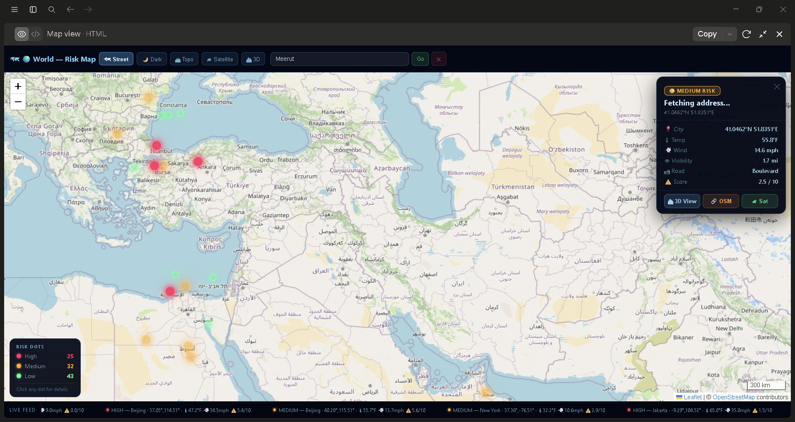

# 🚦 Real-Time Accident Risk Prediction System

A deep learning–based real-time accident risk prediction system with an **interactive 3D globe visualization** and **live street map**, analyzing GPS and weather sensor data streams to predict accident risk severity using LSTM models.

---

## 🗺️ Preview



> *Live risk map showing HIGH / MEDIUM / LOW accident risk dots across cities worldwide, with reverse geocoding, 5 map styles, and real-time data feed.*

---

## 📌 Project Overview

Road accidents are influenced by time, location, and environmental conditions. This project simulates a real-time data pipeline and applies deep learning to predict accident risk dynamically — not just static batch predictions.

The system processes live GPS coordinates, weather parameters, and temporal features to estimate accident severity in real time, visualized on an **interactive 3D WebGL globe** and a **Leaflet-powered street map**.

---

## 🧠 Key Features

- 🌍 **Interactive 3D Globe** — WebGL Earth with 41 country boundaries, risk-colored borders, rotating country labels and city dots
- 🗺️ **Live Street Map** — Leaflet map with 5 styles (Street, Dark, Topo, Satellite, 3D City), 200+ animated risk markers, reverse geocoding
- 🔴 **Real-Time Risk Dots** — HIGH / MEDIUM / LOW risk events animated on globe and map
- 🔍 **City Search** — Instant search with 100+ pre-loaded cities + OpenStreetMap Nominatim geocoder fallback
- 📍 **Click-to-Drill** — Click any country on the globe to zoom in; click any map point for real address + risk details
- 🤖 **LSTM Prediction** — Deep learning model for real-time accident severity prediction
- 📡 **Live GPS Simulation** — Streaming GPS and sensor data mimicking real-time flow
- 📊 **Risk Classification** — Automated LOW / MEDIUM / HIGH risk labeling

---

## 🏗️ System Architecture

```
GPS + Weather Stream
        │
        ▼
Feature Engineering (time, location, weather)
        │
        ▼
LSTM Model (Rolling Window Inference)
        │
        ▼
Risk Score → Classification (Low / Medium / High)
        │
        ▼
┌───────────────────────┐
│  3D WebGL Globe       │  ← world_map_3d.html
│  + Leaflet Map View   │  ← map_view.html
└───────────────────────┘
```

---

## 🔧 Tech Stack

| Layer | Technology |
|-------|-----------|
| **Language** | Python, JavaScript |
| **Deep Learning** | TensorFlow, Keras, LSTM |
| **Data Processing** | Pandas, NumPy, Scikit-learn |
| **3D Globe** | Three.js (WebGL) |
| **Map** | Leaflet.js (self-contained, no CDN) |
| **Map Tiles** | OpenStreetMap, Esri Satellite, OpenTopoMap |
| **Geocoding** | OpenStreetMap Nominatim (reverse + forward) |
| **UI** | Streamlit, HTML/CSS/JS |
| **Version Control** | Git, GitHub |

---

## 📂 Project Structure

```
real-time-accident-prediction/
├── static/
│   ├── world_map_3d.html      # 3D WebGL globe visualization
│   ├── map_view.html          # Leaflet street/satellite map
│   ├── leaflet.min.js         # Leaflet (self-contained)
│   └── leaflet.min.css
├── images/
│   ├── map_preview.png        # Project screenshot
│   └── Deploy.png
├── streaming/
│   └── gps_simulator.py       # Real-time GPS data simulation
├── inference/
│   └── realtime_predictor.py  # LSTM inference engine
├── models/
│   └── saved_model/
│       └── accident_lstm.h5   # Trained LSTM model
├── notebooks/
│   ├── 1_eda.ipynb
│   ├── 2_feature_engineering.ipynb
│   └── 3_model_experiments.ipynb
├── app.py                     # Streamlit dashboard
├── realtime_predictor.py
├── requirements.txt
└── README.md
```

---

## 📊 Model Details

| Property | Value |
|----------|-------|
| **Model Type** | LSTM (Long Short-Term Memory) |
| **Input** | Sequential GPS + weather data (rolling window) |
| **Output** | Accident severity risk score |
| **Features** | Hour, night flag, weekend, lat/lng bins, visibility, wind, temp, precipitation |
| **Prediction** | Continuous score + 3-class risk label |

---

## 🚨 Risk Classification

| Score | Risk Level | Color |
|-------|-----------|-------|
| < 1.8 | 🟢 Low Risk | Green |
| 1.8 – 2.8 | 🟡 Medium Risk | Amber |
| > 2.8 | 🔴 High Risk | Red |

---

## ▶️ How to Run

### 1️⃣ Install dependencies
```bash
pip install -r requirements.txt
```

### 2️⃣ Run real-time LSTM prediction
```bash
python inference/realtime_predictor.py
```

### 3️⃣ Launch Streamlit dashboard
```bash
streamlit run app.py
```

### 4️⃣ Open the 3D Globe
Open `static/world_map_3d.html` in your browser directly.

- **Drag** to rotate the globe
- **Scroll** to zoom in/out
- **Click any country** to drill into risk zones
- Click **"🗺 Open Map"** for the full street map view

### 5️⃣ Open the Street Map
Open `static/map_view.html` in your browser.

- Switch between **Street / Dark / Topo / Satellite / 3D** styles
- Search any city worldwide
- Click any risk dot for full details
- Click anywhere on the map for reverse-geocoded address

---

## 📂 Dataset

Due to large file size, datasets are not included in this repository.

Download from: [Kaggle – US Accidents Dataset](https://www.kaggle.com/datasets/sobhanmoosavi/us-accidents)

Place inside: `data/raw/`

---

## 🎯 Use Cases

- 🚗 Smart traffic monitoring systems
- 📊 Accident prevention analytics
- 🏙️ Intelligent transportation systems
- 🌍 Real-time global risk assessment dashboards
- 📱 Location-aware safety applications

---

## 🚀 Future Improvements

- [ ] Integration with real GPS & weather APIs
- [ ] WebSocket streaming for true real-time updates
- [ ] Advanced models (GRU / Transformer / Attention)
- [ ] Mobile-responsive globe view
- [ ] Cloud deployment (AWS / GCP / Vercel)
- [ ] Historical accident heatmap overlay

---

## 👤 Author

**Shagun Sangwan**
B.Tech Data Science | ML & Deep Learning Enthusiast | Freelance Data Scientist

- 🐙 GitHub: [@shagunsangwan3](https://github.com/shagunsangwan3)
- 💼 Fiverr: [fiverr.com/shagunsangwann](https://www.fiverr.com/shagunsangwann)
- 🌐 Portfolio: [shagunsangwan.in](https://shagunsangwan.in)

---

⭐ **If you find this project useful, give it a star!**
